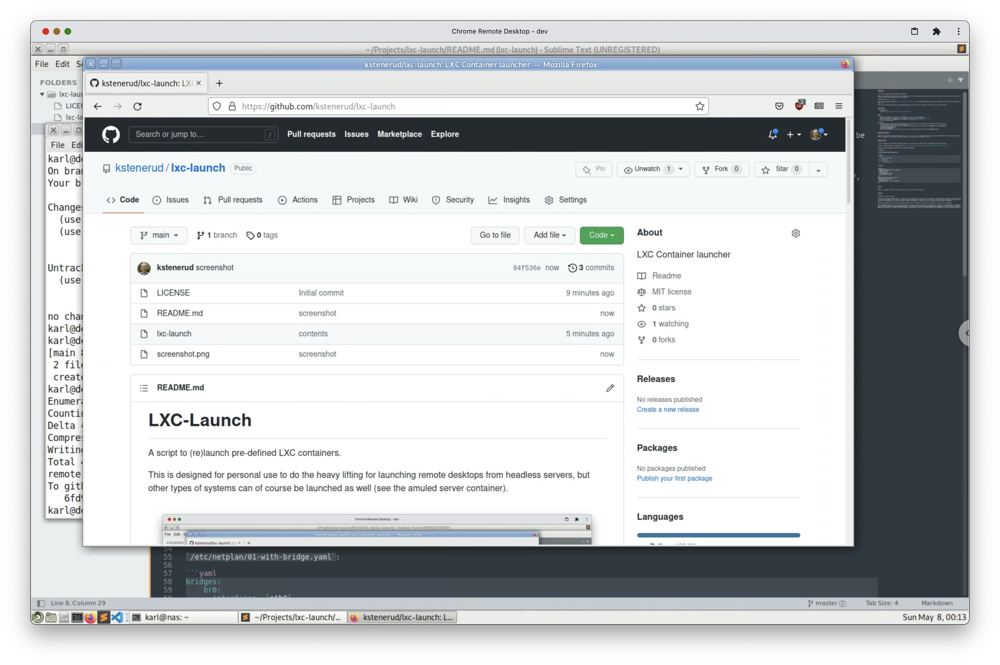

LXC-Launch
==========

A script to (re)launch pre-defined LXC containers.

This is designed for personal use to do the heavy lifting for launching remote desktops from headless servers, but other types of systems can of course be launched as well (see the amuled server container).



I use [Chrome Remote Desktop](https://remotedesktop.google.com/) to provide remote desktop access for convenience sake, but you could also use VNC, XRDP, X2Go, etc.

Note: Your security requirements are probably different from mine. I don't recommend using this script in production!


Requirements
------------
  * A Linux host
  * [LXD](https://linuxcontainers.org/lxd/introduction/)


Usage
-----
  * Change the defaults at the top of [lxc-launch](lxc-launch) to your liking.
  * Define your machine launchers (see section: My Machines in [lxc-launch](lxc-launch))
  * Add your machines to `MACHINES` (at the bottom of [lxc-launch](lxc-launch))
  * lxc-launch your-machine

### Notes
  * lxc-launch will destroy any existing container of the same name, but host-mounted directories will be untouched.
    Use host-mounted directories for persistent data.
  * In-container uid mapping to a host user requires adding entries to your hostside `/etc/subuid` and `/etc/subgid`:
    `root:<host user gid/uid>:1`
    Example: `root:1000:1`
  * The initial password for the admin user is the same as the username (see function `add_basic_user`).


Desktop Environment
-------------------

Desktops use the [Mate desktop environment](https://mate-desktop.org/) because it's very fast when software rendered, and has a small footprint.
Other environments are possible (LXDE, KDE, Budgie, etc) but would need further testing.


Network Bridge
--------------

I find it helpful to bridge the containers directly to my local net so that they can be accessed like a full machine.

**Note**: [WIFI bridging is problematic](https://wiki.debian.org/BridgeNetworkConnections#Bridging_with_a_wireless_NIC)

Examples (replace `eth0` with your actual ethernet interface):

**Netplan**:

`/etc/netplan/01-with-bridge.yaml`:

```yaml
bridges:
    br0:
      interfaces: [eth0]
      dhcp4: true
      parameters:
        stp: false
        forward-delay: 0
```

**NixOS**:

```nix
networking = {
  bridges.br0.interfaces = [ "eth0" ];
  useDHCP = false;
  interfaces = {
    eth0.useDHCP = false;
    br0.useDHCP = true;
  };
};
virtualisation.lxd.enable = true;
virtualisation.libvirtd = {
  enable = true;
  allowedBridges = [ "br0" "virbr0" ];
};
```


Issues
------

There is no sound. I haven't figured out how to set up a virtual sound device.


License
-------

Copyright 2022 Karl Stenerud

Permission is hereby granted, free of charge, to any person obtaining a copy of this software and associated documentation files (the "Software"), to deal in the Software without restriction, including without limitation the rights to use, copy, modify, merge, publish, distribute, sublicense, and/or sell copies of the Software, and to permit persons to whom the Software is furnished to do so, subject to the following conditions:

The above copyright notice and this permission notice shall be included in all copies or substantial portions of the Software.

THE SOFTWARE IS PROVIDED "AS IS", WITHOUT WARRANTY OF ANY KIND, EXPRESS OR IMPLIED, INCLUDING BUT NOT LIMITED TO THE WARRANTIES OF MERCHANTABILITY, FITNESS FOR A PARTICULAR PURPOSE AND NONINFRINGEMENT. IN NO EVENT SHALL THE AUTHORS OR COPYRIGHT HOLDERS BE LIABLE FOR ANY CLAIM, DAMAGES OR OTHER LIABILITY, WHETHER IN AN ACTION OF CONTRACT, TORT OR OTHERWISE, ARISING FROM, OUT OF OR IN CONNECTION WITH THE SOFTWARE OR THE USE OR OTHER DEALINGS IN THE SOFTWARE.
